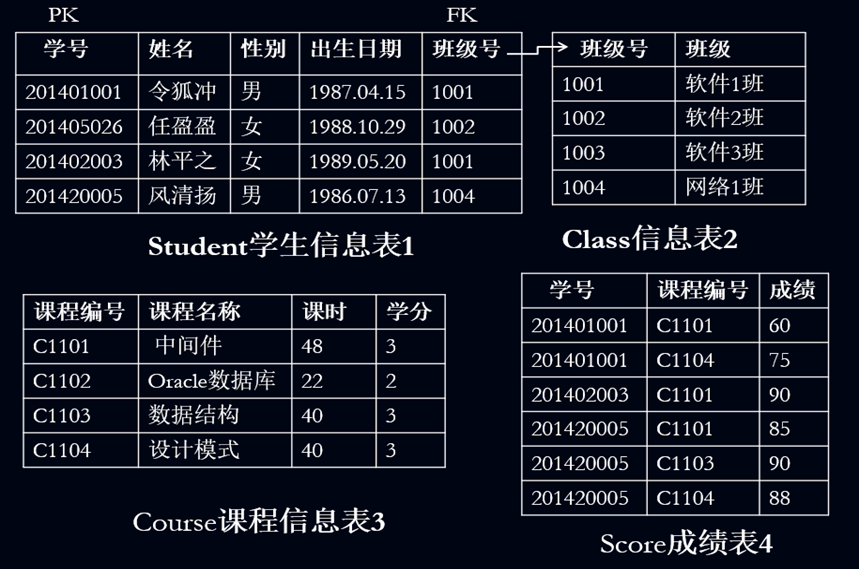

# StudentORM With MySQL
    StudentORM With MySQL，软件平台与中间技术第一次实验，采用Hibernate框架，JDK 版本 16，使用MySQL Server 5作为实验数据库
***
## 一、实验目的与要求
    1. 掌握Java数据访问中间件(JDBC Driver)；
    2. 理解DAO模式并掌握DAO接口实现；
    3. 理解JPA和ORM框架；
    4. 掌握基于Hibernate或MyBatis的持久化开发；
    5. 能够独立完成单表和多表CRUD操作。

***
## 二、实验内容和步骤

实验练习用到的表有：班级表(Class)、学生表(Student)、课程表(Course)和成绩表(Score)\
表间的关联关系：班级与学生是1:n，学生与课程是m:n\
1.使用ORM框架对学生表进行CRUD操作\
2.完成班级与学生的关联关系\
3.完成学生与课程的关联关系